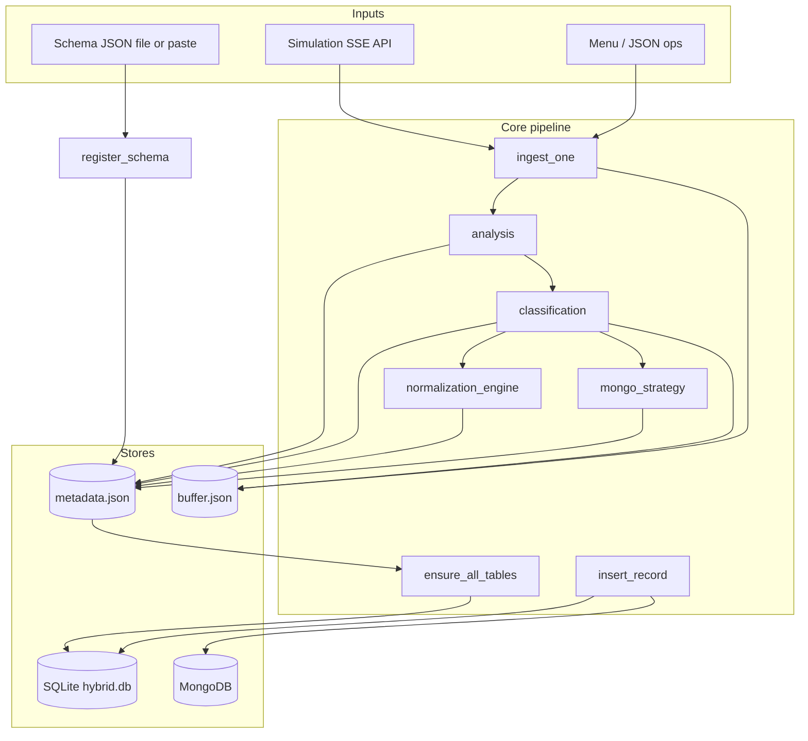

# Hybrid Database Framework — End-to-End Pipeline

This document describes the full ingestion, classification, normalization, persistence, and query pipeline implemented in this project. It is intended to be read alongside the source under `hybrid_framework/` and `main.py`.

---

## Table of contents

1. [Architecture overview](#1-architecture-overview)
2. [Bootstrap and configuration](#2-bootstrap-and-configuration)
3. [Persistent state (`metadata.json`, files, DBs)](#3-persistent-state-metadatajson-files-dbs)
4. [Phase A — Schema registration](#4-phase-a--schema-registration)
5. [Phase B — Record preprocessing (`ingest`)](#5-phase-b--record-preprocessing-ingest)
6. [Phase C — Statistical analysis](#6-phase-c--statistical-analysis)
7. [Phase D — Field classification (SQL / Mongo / undecided)](#7-phase-d--field-classification-sql--mongo--undecided)
8. [Phase E — Normalization (1NF → 2NF → 3NF)](#8-phase-e--normalization-1nf--2nf--3nf)
9. [Phase F — MongoDB strategy](#9-phase-f--mongodb-strategy)
10. [Phase G — DDL (`ensure_all_tables`)](#10-phase-g--ddl-ensure_all_tables)
11. [Phase H — Dual write (`insert_record`)](#11-phase-h--dual-write-insert_record)
12. [Phase I — Buffer and re-evaluation](#12-phase-i--buffer-and-re-evaluation)
13. [Phase J — Queries (read / insert / update / delete)](#13-phase-j--queries-read--insert--update--delete)
14. [Correlation keys](#14-correlation-keys)
15. [In-memory vs persisted sampling](#15-in-memory-vs-persisted-sampling)
16. [Operational checklist](#16-operational-checklist)

---

## 1. Architecture overview

The system implements a **hybrid store**:

- **SQLite** (via SQLAlchemy) holds normalized relational data: a main `records` table, optional **2NF child tables** (repeating groups / nested objects), and **3NF dimension tables**.
- **MongoDB** holds documents for fields classified as Mongo, either **embedded** in a main collection or **referenced** in per-field collections.
- **`metadata.json`** is the **single source of truth** for schema, placements, table definitions, flattened-object maps, 3NF metadata, and Mongo collection layouts.
- **`buffer.json`** holds **undecided** field values per ingest correlation id until enough observations exist to classify them.

**Primary orchestration** lives in `main.py` (interactive menu). Core logic is split across:

| Module | Responsibility |
|--------|----------------|
| `config.py` | Thresholds, paths, `JOIN_KEY`, `GLOBAL_RECORD_KEY_POLICY`, inferred `SECONDARY_JOIN_KEY` |
| `schema_registry.py` | Validate/register schema; apply join-key policy to `config` |
| `metadata_manager.py` | Load/save `metadata.json` slices |
| `ingest.py` | Coerce top-level numerics; assign correlation id |
| `analysis.py` | Batch stats; merge cumulative; derived metrics |
| `classification.py` | SQL vs Mongo vs undecided per field |
| `normalization_engine.py` | FD detection, 2NF/3NF decomposition, SQL table blueprint |
| `mongo_strategy.py` | Embed vs reference; collection field lists |
| `crud.py` | DDL, `insert_record`, read/update/delete across SQL + Mongo |
| `buffer_manager.py` | Pending fields; batch re-classification |
| `query_engine.py` | JSON-shaped operations for menu / API-style use |



---

## 2. Bootstrap and configuration

### 2.1 Path anchoring (`main.py`)

Before importing `hybrid_framework.config`, `main.py`:

1. Resolves **`_PROJECT_ROOT`** to the directory containing `main.py`.
2. Sets **`_ABS_DATA_DIR = _PROJECT_ROOT / "data"`** and creates it.
3. Sets **`HYBRID_SQL_URL`** to an **absolute** SQLite URL pointing at `_ABS_DATA_DIR / hybrid.db`.
4. **Patches** the already-imported `config` module:

   - `config.DATA_DIR`
   - `config.METADATA_FILE`
   - `config.BUFFER_FILE`
   - `config.SQL_URL`

This guarantees that **every module** that does `import hybrid_framework.config as config` shares the same absolute paths, regardless of the process current working directory.

### 2.2 Join key sync on menu entry

`_sync_join_key_from_saved_schema()` reads **`metadata_manager.get_schema()`** and calls **`config.apply_join_key_from_schema(schema)`** so that after a process restart:

- `config.JOIN_KEY` matches the registered schema (e.g. `hybrid_record_id`), and  
- `config.GLOBAL_RECORD_KEY_POLICY` matches (`legacy_timestamp`, `uuid_v4`, or `from_payload`).

### 2.3 Notable `config.py` knobs

| Symbol | Role |
|--------|------|
| `FREQUENCY_THRESHOLD_SQL` | Minimum field presence ratio to favor SQL (when not nested) |
| `TYPE_STABILITY_THRESHOLD` | Minimum share of dominant type to favor SQL |
| `MIN_FIELD_OBSERVATIONS` | Minimum samples before trusting heuristics (schema can bypass for required fields) |
| `FD_SAMPLE_SIZE` | Max records kept in memory for functional-dependency sampling |
| `FD_THRESHOLD` | Fraction of A→B mappings that must be functional for an FD |
| `MAX_INLINE_FIELDS` | Nested object with ≤ this many **scalar** sub-keys may inline into `records` |
| `MONGO_EMBED_MAX_ARRAY_LENGTH` | Average array length heuristic for embed vs reference |
| `DEFAULT_JOIN_KEY` / `JOIN_KEY` | Correlation column name (overridden by schema) |
| `GLOBAL_RECORD_KEY_POLICY` | How `JOIN_KEY` is populated at ingest |
| `SECONDARY_JOIN_KEY` | Optional; **inferred** from schema scalars (not user-set); used for child SQL / Mongo anchors |

---

## 3. Persistent state (`metadata.json`, files, DBs)

### 3.1 `data/metadata.json` (logical sections)

Typical keys (exact merge behavior is in `metadata_manager.py`):

| Key | Content |
|-----|---------|
| `schema` | Full registered schema including `fields`, optional `global_record_key` |
| `schema_nested_paths` | Flat index of nested shapes: dot paths like `billing_address.city`, `active_orders.sku`, plus `field[]` / `field[][]` for array element types (written whenever `save_schema` runs) |
| `cumulative_stats` | Raw merged counters: `total_records`, per-field `presence_count`, `types`, `unique_count_approx`, `has_nested`; dict-valued top-level fields may include **`subfields`** with the same counters per immediate child key (observed in data) |
| `field_placement` | Per field: `backend` (`sql` \| `mongo` \| `undecided`), `unique`, `reason`, optional `table`, `collection`, `dimension_table`, `strategy` |
| `sql_tables` | Table definitions: columns, `sql_type`, PK, FKs |
| `flattened_objects` | Map: original object field → list of dot-notation column names on `records` |
| `dimension_tables_meta` / `3nf_dimension_tables` | 3NF dimension metadata for CRUD routing |
| `mongo_collections` | Logical Mongo layout: `main_documents` + reference collections |

### 3.2 `data/hybrid.db`

SQLite database created/altered by **`CRUDManager.ensure_all_tables`** from `sql_tables`.

### 3.3 MongoDB

Database name from `config.MONGO_DB` (default `hybrid_db`). Collections and fields are driven by saved `mongo_collections`.

### 3.4 `data/buffer.json`

Structure used by `BufferManager`:

```json
{
  "pending_fields": {
    "<JOIN_KEY value>": { "field_name": <value>, ... }
  },
  "new_since_last_eval": <int>
}
```

---

## 4. Phase A — Schema registration

**Trigger:** Main menu **[1]**.

**Steps:**

1. User provides JSON (multi-line or `file` + path).
2. **`schema_registry.register_schema(schema_dict)`**:
   - **`validate_schema`**: `fields` required; each field has `type` ∈ {`int`,`float`,`str`,`bool`,`array`,`object`}; arrays need `items`; objects need `properties`; optional **`global_record_key`** must point to a `str` field with `not_null` + `unique`.
   - **`metadata_manager.save_schema`**: persists under `metadata["schema"]` and builds **`metadata["schema_nested_paths"]`** from nested `properties` / `items`.
   - **`config.apply_join_key_from_schema`**: sets `JOIN_KEY` and `GLOBAL_RECORD_KEY_POLICY` (or resets to legacy if no `global_record_key`).
3. **Optional recompute** (if cumulative stats exist and `_record_sample` is non-empty):
   - `analysis.cumulative_raw_to_derived` → **`normalization_engine.run_normalization`** → **`mongo_strategy.run_mongo_strategy`** → **`crud_mgr.ensure_all_tables`**.

**Outcome:** Validated schema on disk; runtime join key aligned; physical model can be refreshed without re-ingesting if sample data exists.

---

## 5. Phase B — Record preprocessing (`ingest`)

**Module:** `ingest.py` — **`ingest_one(raw: dict)`**.

1. **`coerce_numeric_strings`**: for each **top-level** key, if value is a `str`, try `int` then `float`; otherwise leave unchanged. Nested dicts/lists are not walked.
2. **Correlation id** — set `record[config.JOIN_KEY]`:
   - **`legacy_timestamp`**: `datetime.now(timezone.utc).isoformat()` (used when schema has no `global_record_key`).
   - **`uuid_v4`**: `str(uuid.uuid4())`.
   - **`from_payload`**: require non-empty existing value; else **`ValueError`**.

**Important:** Ingest does **not** enforce schema-only keys; unknown top-level keys still appear in records and later in stats/classification.

---

## 6. Phase C — Statistical analysis

**Module:** `analysis.py`.

### 6.1 Per-batch: `analyze_buffer(records)`

For each record and each **top-level** field:

- Increment **`presence_count`**.
- Classify value with **`_value_type`** (`null`, `bool`, `int`, `float`, `str`, `list`, `dict`, `unknown`).
- Update type histogram.
- Track **uniqueness**: scalars in a set; dict/list use `str(value)` for hashing (approximate).
- Set **`has_nested = True`** if any value was `list` or `dict`.

Returns a structure with `batch_size` and `fields[field] → { presence_count, types, unique_count, has_nested }`, plus optional **`subfields`** for top-level keys whose values are **dicts** (per-child-key stats for the batch).

### 6.2 Merge: `merge_cumulative_stats(prev, batch_result, batch_size)`

- Increments **`total_records`**.
- Merges per-field presence and type counts.
- ORs **`has_nested`** across batches.
- Adds batch **`unique_count`** into **`unique_count_approx`** (documented as a simplified merge, not exact global cardinality).
- When a field has **`subfields`** in the batch, merges those child-key counters the same way (classification still uses **top-level** fields only).

### 6.3 Derived: `cumulative_raw_to_derived(cumulative_raw)`

For each field:

- **`frequency`** = `presence_count / total_records`
- **`dominant_type`** = argmax of type counts
- **`type_stability`** = count of dominant type / `presence_count`
- **`uniqueness_ratio`** = min(1.0, `unique_count_approx / presence_count`)
- **`has_nested`** from cumulative raw

**Persistence:** `metadata_manager.save_cumulative_stats` writes the merged raw cumulative blob and total records seen.

---

## 7. Phase D — Field classification (SQL / Mongo / undecided)

**Module:** `classification.py` — **`classify_fields(derived_stats)`**.

Loads **`schema_registry.get_schema()`** for optional constraints.

**Per field:**

1. **If field name == `config.JOIN_KEY`:** always **SQL**, `unique: True`, `reason: join_key`.
2. **Low observation count** (`presence_count < MIN_FIELD_OBSERVATIONS`):
   - If field in schema with **`not_null`:** immediate decision from schema type — **SQL** if not `array`/`object`, else **Mongo**; `reason: schema_required_immediate`.
   - Else: **undecided**, `reason: insufficient_observations`.
3. **Otherwise:**
   - If **`has_nested`:** **Mongo**, `reason: nested_or_complex`.
   - Else if **`frequency >= FREQUENCY_THRESHOLD_SQL`** and **`type_stability >= TYPE_STABILITY_THRESHOLD`:** **SQL**, `reason: stable_flat`.
   - Else: **Mongo**, `reason: unstable_or_sparse`.

**Uniqueness hint:** `unique` is true if `uniqueness_ratio >= 0.95` or schema marks `unique: true`.

**Persistence:** `metadata_manager.save_field_placement(decisions)` — **full map replace** on this call; later normalization **merges** on top (see Phase E).

---

## 8. Phase E — Normalization (1NF → 2NF → 3NF)

**Entry:** `normalization_engine.run_normalization(all_records, field_stats, schema)`.

**Precondition:** Schema registered (menu **[2]** skips full normalization if no schema and builds a minimal `records` definition instead).

### 8.1 Inputs

- **`all_records`:** in-memory `_record_sample` (FIFO capped by `FD_SAMPLE_SIZE`).
- **`field_stats`:** derived cumulative stats (same shape as `cumulative_raw_to_derived` output).
- **`schema`:** registered schema dict.

### 8.2 Step 1 — SQL field list

Fields included in normalization are those with **`field_placement[f].backend == "sql"`** at this moment.

### 8.3 Step 2 — Natural entity PK (candidate)

**`detect_entity_identifier(field_stats, schema)`**

- Considers only fields present in schema + stats, scalar dominant types (excludes list/dict).
- **Excludes `config.JOIN_KEY`** so the correlation id is never the “business” PK.
- Prioritizes schema **`unique` + `not_null`** with **`uniqueness_ratio >= 0.99`**, then high observed uniqueness; prefers integer tie-breaks.

May return **`None`** if no suitable candidate.

### 8.4 Step 3 — Functional dependencies (3NF input)

**`detect_functional_dependencies(records, sql_fields, sample_size)`**

- Samples up to `sample_size` records.
- **Excludes `JOIN_KEY`** from determinant and dependent sets (avoids trivial FDs).
- Skips pairs where either value is `None`.
- For each ordered pair (A,B), builds map A_value → set of B values; if “single-valued B” holds for ≥ **`FD_THRESHOLD`** fraction of A values in the sample, records FD A → B.

### 8.5 Step 4 — Repeating groups (2NF)

**`detect_repeating_groups(schema, field_stats, records)`**

- For schema fields that are array-like in data (`list`) and match schema/array heuristics:
  - Scans list elements; if elements are **dicts with only scalar values** (no nested list/dict in values), may mark as SQL child table candidate.
  - Collects **all sub-keys seen in data** (not limited to `items.properties`).
- Produces groups with `parent_field`, `child_table_name`, `sub_fields`, `goes_to_sql`.

Deep nesting or non-flat rows tend to be excluded from SQL normalization here.

### 8.6 Step 5 — Nested objects (2NF)

**`detect_nested_objects(schema, field_stats, records)`**

- For schema **`type: object`** with dominant type **`dict`**:
  - Aggregates **all sub-keys** from sample dicts and whether values are all scalars.
  - **≤ `MAX_INLINE_FIELDS` and all scalar → `inline`** (dot columns on `records`).
  - **All scalar but too many keys → `separate_table`** (child table).
  - **Any non-scalar sub-value → `mongo`** for that object field’s normalization strategy.

### 8.7 Step 6 — `build_sql_table_schema`

Builds:

- **`records`:** scalar SQL columns not moved to dimensions/children; **`JOIN_KEY`** column (typed from schema when available); PK = natural PK if present else **`JOIN_KEY`**.
- **2NF child tables:** `_row_id`, **`JOIN_KEY`**, optional inferred secondary column, optional natural PK column, plus sub-field columns (SQL types from schema `items.properties` / `object.properties` when possible).
- **3NF dimension tables:** from **`decompose_for_3nf`** — clusters mutually FD-related determinants, picks cluster PK, moves dependent attributes to `*_dim` tables, adds FK from `records` to dimension PK.

Returns:

```text
{
  "tables": { ... },
  "flattened_objects": { parent_field: [ "parent.sub", ... ] },
  "dimension_tables_meta": { ... }
}
```

### 8.8 Step 7 — Persist + placement overlay

- **`metadata_manager.save_sql_tables(result)`** — atomic update of `sql_tables` + `flattened_objects`.
- **`metadata_manager.save_3nf_dimension_tables(dimension_tables_meta)`**.
- **Placement merge:** builds `new_placements` for:
  - repeating-group parent → child `table`
  - nested object → `records` + strategy
  - 3NF: determinant column on `records` with `dimension_table`; dependent fields → dimension `table`
- Reads **existing** `field_placement`, then **`save_field_placement({**existing**, **new**})`** so fields not involved in normalization are preserved.

---

## 9. Phase F — MongoDB strategy

**Entry:** `mongo_strategy.run_mongo_strategy(mongo_fields, field_stats, schema, sample_records)`.

- **`mongo_fields`:** all fields with `backend == "mongo"` from the **latest** classification map (after normalization merge).
- For each field (except join/secondary keys), **`decide_strategy`** chooses **embed** vs **reference** using array size, nested arrays, heuristics.
- **`build_mongo_collection_schema`**:
  - **`main_documents`:** always includes `JOIN_KEY` and, when inferred, the secondary field; embedded fields listed.
  - **Reference collections:** named after the field; `fields` = union of dict keys seen in referenced array items + anchor field names.

**Persist:** `metadata_manager.save_mongo_collections(result)`.

---

## 10. Phase G — DDL (`ensure_all_tables`)

**`CRUDManager.ensure_all_tables(sql_tables)`** in `crud.py`:

- For each table in metadata:
  - If missing: **`CREATE TABLE`** with column types, PK, NOT NULL, UNIQUE as specified.
  - If present: **ALTER** path (implementation adds missing columns as needed for evolution).

**Critical ordering in menu [2]:** normalization → mongo strategy → **`ensure_all_tables`** → **then** `insert_record` loop. DDL must complete before inserts.

---

## 11. Phase H — Dual write (`insert_record`)

**`CRUDManager.insert_record(decided_rec, sql_tables, mongo_collections, field_placement, flattened_objects)`**

Responsibilities (simplified):

- **SQL:** insert into `records` with scalars; map **flattened** object keys to dot columns; route **3NF** fields to dimension tables; insert **child** rows for repeating groups / nested separate tables; use **`JOIN_KEY`** and the inferred secondary field when present.
- **Mongo:** if available, write **main_documents** and **reference** collections according to `mongo_collections` and placement.

Errors surface to the caller (menu counts errors).

**Read path** (`execute_read`) reverses flattening and joins child/dimension/mongo data using the same metadata.

---

## 12. Phase I — Buffer and re-evaluation

### 12.1 When fields land in the buffer

After classification, any field with **no placement** or **`backend == "undecided"`** is **not** in `decided_rec` for SQL/Mongo routing (except `JOIN_KEY` is forced into `decided_rec`). Those key-value pairs go to **`buffer_mgr.add_pending_fields(JOIN_KEY, undecided_fields)`**.

### 12.2 Automatic re-evaluation

When **`new_since_last_eval >= BUFFER_BATCH_SIZE`**:

- Rebuild mini-records from `pending_fields`.
- Merge their stats into cumulative stats.
- Re-run **`classify_fields`**.
- **`commit_classified_field`** for fields that became sql/mongo (writes through CRUD where implemented).

### 12.3 Manual flush (menu **[5]**)

**`force_flush`** — user-confirmed path that pushes buffered data toward Mongo (see `buffer_manager.py` implementation for exact behavior).

---

## 13. Phase J — Queries (read / insert / update / delete)

**Module:** `query_engine.py` — **`handle_query(operation_json)`**.

Loads fresh metadata: `sql_tables`, `mongo_collections`, `field_placement`, `flattened_objects`, `schema`.

| Operation | Flow |
|-----------|------|
| **read** | `crud_manager.execute_read(...)` with filters/fields |
| **insert** | `ingest.ingest_one(record)` then split decided/buffer like menu [2]; `insert_record`; buffer undecided |
| **delete** | `execute_delete` — cascades via `JOIN_KEY` across SQL tables and Mongo |
| **update** | `execute_update` with flattening + placement awareness |

Mongo filters from CLI strings may be **coerced** to numeric types in CRUD for matching.

---

## 14. Correlation keys

| Key | Purpose |
|-----|---------|
| **`JOIN_KEY`** (`config.JOIN_KEY`) | **Global correlation id** for one logical ingest row: replicated on `records`, child SQL tables, and Mongo docs. Name comes from schema `global_record_key.field` or legacy `sys_ingested_at`. |
| **`SECONDARY_JOIN_KEY`** | **Inferred** at schema registration (best scalar after `global_record_key`: str+not_null preferred; ties → earlier field in schema). `None` if no suitable field. |

Normalization and CRUD assume these columns exist where metadata declares them.

---

## 15. In-memory vs persisted sampling

| Mechanism | Scope | Survives restart? |
|-----------|--------|-------------------|
| `_record_sample` in `main.py` | Rolling window for FD + mongo heuristics | **No** |
| `cumulative_stats` in `metadata.json` | Global type/frequency/uniqueness trends | **Yes** |
| `field_placement`, `sql_tables`, `mongo_collections` | Routing + DDL blueprint | **Yes** |

After restart, **FD detection** is weaker until the in-memory sample refills, but **classification** still uses cumulative derived stats.

---

## 16. Operational checklist

1. Start **MongoDB** if you want dual-store (optional; SQL-only otherwise).
2. Start **simulation API** (`http://127.0.0.1:8000`) for stream ingest menu **[2]**.
3. Run **`main.py`** from the project directory (or rely on path patching under `main.py`).
4. Menu **[1]** — register schema (e.g. load `hybrid_framework/schema.json`).
5. Menu **[2]** — ingest batches; inspect **[4]** metadata or placement summary printed after ingest.
6. Use **[3]** for CRUD, **[5]** for buffer flush, **[6]** for full reset.

---

## Appendix A — Menu **[2]** sequence (concise)

1. Fetch SSE records → for each: **`ingest_one`** → append to `_record_sample` (trim to `FD_SAMPLE_SIZE`).
2. **`analyze_buffer`** → **`merge_cumulative_stats`** → **`save_cumulative_stats`**.
3. **`cumulative_raw_to_derived`** → **`classify_fields`** → **`save_field_placement`**.
4. If schema: **`run_normalization`** → **`run_mongo_strategy`**; else minimal SQL tables for classified SQL fields only.
5. **`ensure_all_tables`**.
6. For each processed record: split decided vs undecided → **`insert_record`** → **`add_pending_fields`** for undecided.
7. Print summary + buffer stats.

---

## Appendix B — Key files quick reference

| Path | Role |
|------|------|
| `main.py` | Menu, SSE fetch, orchestration, `_record_sample` |
| `hybrid_framework/schema.json` | Example / default schema file (load via menu **file**) |
| `hybrid_framework/config.py` | Thresholds and join-key policy |
| `hybrid_framework/schema_registry.py` | Validation + registration |
| `hybrid_framework/metadata_manager.py` | `metadata.json` I/O |
| `hybrid_framework/ingest.py` | Preprocessing + correlation id |
| `hybrid_framework/analysis.py` | Stats |
| `hybrid_framework/classification.py` | SQL/Mongo/undecided |
| `hybrid_framework/normalization_engine.py` | 1NF–3NF blueprint |
| `hybrid_framework/mongo_strategy.py` | Mongo layout |
| `hybrid_framework/crud.py` | DDL + CRUD |
| `hybrid_framework/buffer_manager.py` | Pending fields |
| `hybrid_framework/query_engine.py` | JSON query adapter |
| `data/metadata.json` | Persistent control plane |
| `data/hybrid.db` | SQLite data plane |
| `data/buffer.json` | Pending field values |

---

*Generated for the Hybrid Database Framework assignment codebase. Update this file if you change thresholds, metadata layout, or orchestration in `main.py`.*
